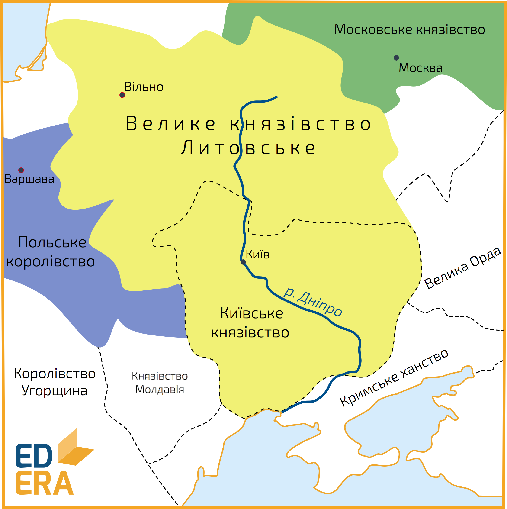
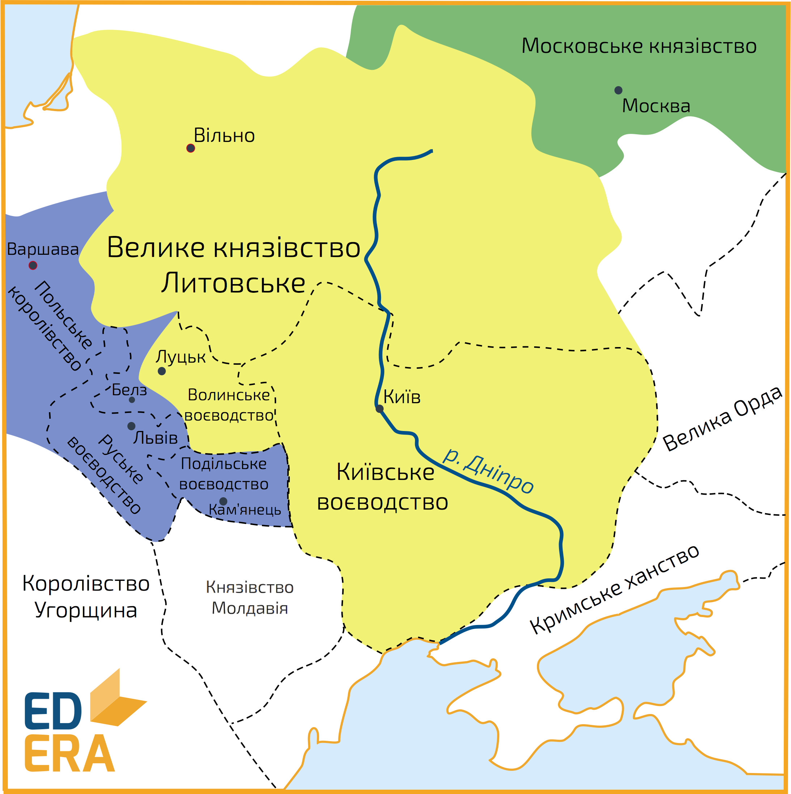

# Казимир IV Ягайлович. Відновлення й остаточна ліквідація Київського та Волинського удільних князівств

<iframe align="center" width="560" height="315" src="https://www.youtube.com/embed/bqJoo-nhlYk" frameborder="0" allowfullscreen></iframe>

Новообраним литовським князем після смерті Сигізмунда в <b>1440 році</b> стає Казимир IV Ягайлович. Разом із литовськими феодалами, він вдається до поступок місцевим князям та боярам аби запобігти новим соціально-політичним виступам і відновлює Київське та Волинське удільні князівства, надавши їм автономію. Волинське князівство було віддане Свидригайлу, а в Київському князівстві був посаджений Олександр (Олелько) Володимирович (1441-1454 рр.) з династії Ольгердовичів (син Володимира Ольгердовича). Свидригайло управляв князівством до кінця свого життя, а по його смерті за наказом Казимира, <b>Волинське удільне князівство</b> в <b>1452 році</b> ліквідовується. 

Щодо діяльності Олелька та його сина Семена (1455-1470 рр.), то їхнє князювання на Київщині характеризувалося відновленням та посиленням соціально-економічного потенціалу князівства, розбудовою міста Києва та культурно-просвітницькою діяльністю. Окрім цього, за Олельковичів розширюються територіальні володіння, в результаті чого під їхньою владою опиняється Київщина, частина Чернігівщини, Переяславщина та Брацлавщина (Східне Поділля); ведеться активна боротьба з татарами на прикордонних смугах, що сприяло освоєнню степу (Дикого Поля) на півдні володінь. Доволі важливою подією, стало створення Київської православної митрополії в <b>1458 році</b> за сприяння Семене Олельковича, що значно послабило московський вплив на руське населення.

Після смерті князя Семена, в <b>1471 році</b>, <b>Київське удільне князівство</b> ліквідовується, у зв’язку із занепокоєнням Казимира в зростанні могутності Києва та прилеглих до нього територій. Волинь і Київщина після остаточної ліквідації решток самостійності перетворюються на <i>воєводства</i>, очолювані намісниками (воєводами) з підпорядкуванням великому князеві. 

З ліквідацією удільних князівств значно посилюється вплив литовсько-польської еліти на соціально-політичні процеси всередині країни, що не могло не зачіпати інтересів православної руської знаті. Однією із спроб повернути своє впливове становище була організована в <b>1481 році</b> змова з боку <i>нащадків Олельковичів</i> мета якої полягала у поновленні влади над своїми колишніми володіннями, з подальшим їхнім відділенням від Литовської держави та приєднанням до Москви. Однак, змову було розкрито, а її учасників піддали страті.

Ще однією спробою, і власне останньою, став виступ <i>князя Михайла Глинського</i> у <b>1508 році</b>. Повстання охопило Київську та Турівську землі, однак незначна підтримка з боку решти князів, та невдачі на полі бою призвели до придушення заколоту польсько-литовським військом.

<quiz>
<question>
	
В якому році новообраним литовським князем стає Казимир IV Ягайлович?

        <answer>1429 р.</answer>
	<answer>1430 р.</answer>
        <answer>1439 р.</answer>
	<answer correct>1440 р.</answer>
</question>

<question>
	
1458 року за сприяння Семена Олельковича

        <answer>утворюється Велике князівство Руське</answer>
	<answer correct>створюється Київська православна митрополія</answer>
        <answer>ліквідовується Київське удільне князівство</answer>
	<answer>Київське удільне князівство об’єднуються з Волинським князівством</answer>
</question>
</quiz>