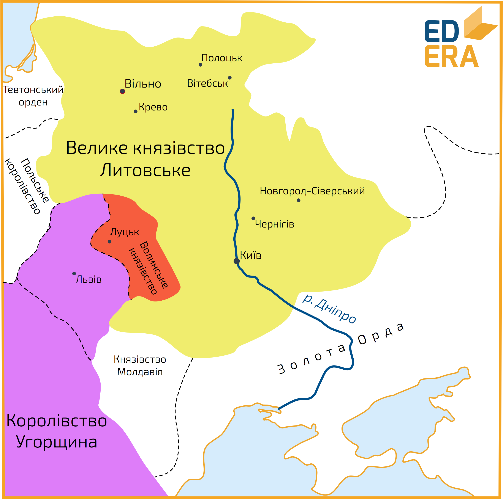
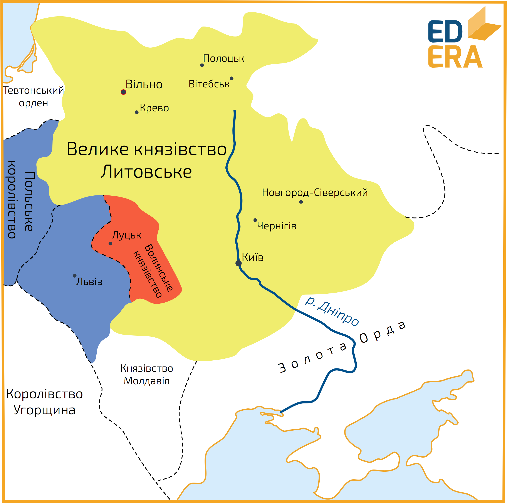

# Утвердження польської влади на Галичині

<iframe align="center" width="560" height="315" src="https://www.youtube.com/embed/KnvRn5n-jRA" frameborder="0" allowfullscreen></iframe>

По смерті Юрія ІІ Болеслава розпочинаються активні військові дії з боку сусідніх держав щодо території Волині та Галичини. В 1340 році польський король Казимир ІІІ Великий вторгається на Галичину, захоплює, але не втримує Львів, у зв’язку з сильним опором місцевого населення. Все ж,  приєднати до Польщі Галицькі землі йому тоді не вдалося, так як бояри на чолі з Дмитром Дедьком заручилися татарською допомогою. Казимир ІІІ Великий відступає, і владу на Галичині зосереджує в своїх руках Дедько. На Волині ж, розпочинає правити литовський князь Любарт Гедимінович, якого було запрошено на престол місцевими боярами, однак влада якого, формально, поширювалася і на Галичину, так як тодішній її управитель Дмитро Дедько визнав себе васалом Любарта.

За Любарта Гедиміновича, Волинь перетворюється на доволі потужний соціально-економічний регіон. Він розбудовував міста (за його ініціативи було побудовано місто Любар), сприяв веденню торгівлі, релігійно-культурним процесам на території своїх володінь, адже опікувався освітою, підтримував руську мову, культуру, православну віру. За Любарта столицю князівства було перенесено до Луцька,  де було побудовано загальновідомий усім оборонний Луцький замок, а саме місто було розбудовано та добре укріплене за всіма військовими вимогами того часу.

В середині 40-х років Казимир знову вдається до військових дій, і доволі успішних так як йому вдалося захопити Сяноцьку землю. Восени 1349 року розпочинається широкомасштабний похід внаслідок якого до Польщі відходить Галичина та Холмщина.
 

Любартом була здійснена безуспішна спроба повернути втрачені землі, та врешті-решт, <b>1352 року</b> Польща 	й Литва укладають домовленість згідно умов якої Галичина відходить до Польщі,  а Волинь закріплюється за Литвою. У 1382 році Любарту вдалося повернути відібрані Польщею землі, однак після його смерті, Галичину знову відвойовують поляки. 

Після смерті Казимира ІІІ, поляки передають (через династичну угоду) Галичину Угорщині королем якої на той час був Людовік (Лайош) Угорський. Однак, той у свою чергу, передає її сілезькому князю Владиславу Опольському, який являвся йому племінником. Владислав на підлеглих йому землях проводив власну самостійницьку політику, яка передбачала опору на поляків, німців та угорців з активною підтримкою католицизму.

1387 року Польща захоплює Галичину внаслідок смерті Владислава, чому посприяло обрання  його дочки, Ядвіги, королевою Польщі, чоловіком якої за умовами Кревської унії став литовський князь Ягайло. Галицько-Волинська держава остаточно припинила своє існування. 

Утвердження польської влади на українських землях відбувалося через ополячення та окатоличення місцевого населення, внаслідок чого здійснюється остаточна ліквідація залишків їхньої політичної автономії та самостійності.

<quiz>
<question>
	
В 1340 році польський король Казимир ІІІ Великий вторгається на

        <answer>Волинь</answer>
	<answer>Поділля</answer>
        <answer>Київщину</answer>
	<answer correct>Галичину</answer>
</question>

<question>
	
За Любарта Гедиміновича столицю князівства перенесено до

        <answer correct>Луцька</answer>
	<answer>Любара</answer>
        <answer>Холму</answer>
	<answer>Володимира</answer>
</question>
</quiz>